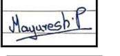
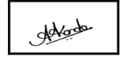
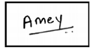
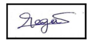
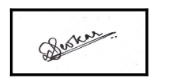

<!-- =========================================================================================
                                     HEADER SECTION
     ========================================================================================= -->

  

  # Business Communication and Ethics

  ### CSL505 · Semester V · Computer Engineering

  
  
  
  

  **A comprehensive academic resource for Business Communication and Ethics (BCE), covering interpersonal skills, professional ethics, corporate communication, and soft skills development.**

  ---

  [Overview](#overview) &nbsp;·&nbsp; [Contents](#repository-contents) &nbsp;·&nbsp; [Reference Books](#reference-books) &nbsp;·&nbsp; [Assignments](#assignments) &nbsp;·&nbsp; [Quizzes](#quizzes) &nbsp;·&nbsp; [Activities](#activities) &nbsp;·&nbsp; [Google Meet](#google-meet) &nbsp;·&nbsp; [Syllabus](#syllabus) &nbsp;·&nbsp; [Usage Guidelines](#usage-guidelines) &nbsp;·&nbsp; [License](#license) &nbsp;·&nbsp; [About](#about-this-repository) &nbsp;·&nbsp; [Acknowledgments](#acknowledgments)

---

<!-- =========================================================================================
                                     OVERVIEW SECTION
     ========================================================================================= -->
## Overview

Business Communication and Ethics (CSL505) is a core subject in the Third Year (Semester V) of the Computer Engineering curriculum at the University of Mumbai. This course focuses on developing essential professional skills, including effective communication, ethical decision-making, and corporate etiquette required for the modern workplace.

### Course Topics

The curriculum encompasses several key domains in Business Communication and Ethics:

- **Communication Theory**: Verbal and non-verbal communication, barriers to communication.
- **Business Writing**: Reports, proposals, emails, and statement of purpose (SOP).
- **Interpersonal Skills**: Group discussions, interviews, and presentation skills.
- **Professional Ethics**: Corporate social responsibility, code of conduct, and ethical dilemmas.
- **Technical Writing**: Documentation standards and project report writing.
- **Team Dynamics**: Leadership, conflict resolution, and collaborative working.

### Repository Purpose

This repository represents a curated collection of study materials, reference books, assignments, and personal preparation notes compiled during my academic journey. The primary motivation for creating and maintaining this archive is simple yet profound: **to preserve knowledge for continuous learning and future reference**.

As a computer engineer, soft skills and ethical grounding are as critical as technical prowess. This repository serves as my intellectual reference point: a resource I can return to for reviewing communication strategies and ethical guidelines.

**Why this repository exists:**

- **Knowledge Preservation**: To maintain organized access to comprehensive study materials beyond the classroom.
- **Continuous Learning**: To support lifelong learning by enabling easy revisitation of fundamental soft skills.
- **Academic Documentation**: To authentically document my learning journey through BCE.
- **Community Contribution**: To share these resources with students and learners who may benefit from them.

All materials in this repository were gathered, organized, and documented by me during my undergraduate studies (2018-2022) as part of my coursework and exam preparation.

---

<!-- =========================================================================================
                                     CONTENTS SECTION
     ========================================================================================= -->
## Repository Contents

### Reference Books

This collection includes **comprehensive reference materials** covering all major topics:

| # | Resource | Focus Area |
|:-:|:---|:---|
| 1 | [Semester 5 Books](Reference%20Books/Semester%205%20Books.png) | Curated book recommendations |

---

<!-- =========================================================================================
                                     ASSIGNMENTS SECTION
     ========================================================================================= -->
### Assignments

Academic assignments for comprehensive learning and practice:

| # | Assignment | Description | Date |
|:-:|:---|:---|:---:|
| 1 | [Assignment 1](Assignments/Amey_B-50_BCE_Assignment-1.pdf) | Communication Barriers and Ethics | September 10, 2020 |
| 2 | [Assignment 2](Assignments/Amey_B-50_BCE_Assignment-2.pdf) | Business Correspondence | September 10, 2020 |
| 3 | [Assignment 3](Assignments/Amey_B-50_BCE_Assignment-3.pdf) | Report Writing and Proposals | September 20, 2020 |
| 4 | [Assignment 4](Assignments/Amey_B-50_BCE_Assignment-4.pdf) | Career Skills and Technical Writing | December 13, 2020 |

---

<!-- =========================================================================================
                                     QUIZZES SECTION
     ========================================================================================= -->
### Quizzes

BCE-specific quizzes conducted during the course:

| # | Quiz | Topics | Date | Marks |
|:-:|:---|:---|:---:|:---:|
| 1 | [Quiz 1](Quizzes/BCE-QUIZ-1-Body%20Language%20and%20Presentation%20Skills-IAT-October%202020.pdf) | Body Language and Presentation Skills (IAT) | October 2020 | 14/20 |

---

### Activities

Practical activities and role-play simulations conducted for skills enhancement:

| # | Activity | Description | Date |
|:-:|:---|:---|:---:|
| 1 | [Internet Marketing](Activities/B-31%2C34%2C50%2C58%2C59_BCE_IM_BLACKBOOK.pdf) | Comprehensive Blackbook Report | December 15, 2020 |
| 2 | [Internet Marketing PPT](Activities/B-31%2C34%2C50%2C58%2C59_BCE_IM_PPT.pdf) | Presentation Slides for the project | December 15, 2020 |
| 3 | [Meeting Simulation](Activities/B-31%2C34%2C50%2C58%2C59_BCE_MOCK_MEETING.pdf) | Mock Meeting Agenda and Minutes | December 15, 2020 |
| 4 | [Statement of Purpose](Activities/Amey_B-50_SOP.pdf) | Professional SOP writing | December 15, 2020 |

<b>Blackbook Details: Internet Marketing</b> - <a href="Activities/B-31%2C34%2C50%2C58%2C59_BCE_IM_BLACKBOOK.pdf"><b>View Document</b></a>

**Project Report**: Internet Marketing (Third Year / Sem V)  
**Degree**: Bachelor Of Engineering (Computer Engineering)  
**Guide**: Prof. S M Sirsath

> **Abstract**: A unique platform that connects people worldwide and at the same time brings truck loads of information on almost anything you can imagine. Internet is the new age tool for marketers to optimize their businesses. There has been a huge growth in the internet usage in the last decade. The cost effective reach and huge growth combined makes Internet marketing a great avenue for any business. With the masses clinging on to the web, innovative companies have created businesses around it that were unheard of until the last decade.

**Declaration & Signatures**:

| # | Name | Class & Roll No. | Student ID | Signature |
|:-:|:---|:---:|:---:|:---:|
| 1 | **Mr. Mayuresh Phansikar** | TE-Comps B-31 | TU3F1819102 |  |
| 2 | **Mr. Archit Konde** | TE-Comps B-34 | TU3F1819107 |  |
| 3 | [**Mr. Amey Thakur**](https://github.com/Amey-Thakur) | TE-Comps B-50 | TU3F1819127 |  |
| 4 | [**Ms. Mega Satish**](https://github.com/msatmod) | TE-Comps B-58 | TU3F1819139 |  |
| 5 | **Ms. Saakshi Deokar** | TE-Comps B-59 | TU3F1819140 |  |

**Table of Contents**:
1. Evolution of Marketing
2. Growth Of Internet Usage in India and the World
3. Overview of Indian Users
4. Understanding Internet Customers
5. 7 P’s Of Internet Marketing
6. Internet Marketing & Its Tools
7. E-commerce & Online Shopping
8. E-ticketing
9. Blogging as a business
10. Challenges to Internet Marketing
11. Traditional Marketing v/s Internet Marketing
12. Future Of Internet Marketing & Conclusion

<b>PPT Details: Internet Marketing</b> - <a href="Activities/B-31%2C34%2C50%2C58%2C59_BCE_IM_PPT.pdf"><b>View Document</b></a>

**Presentation**: Internet Marketing (Third Year / Sem V)  
**Degree**: Bachelor Of Engineering (Computer Engineering)  
**Guide**: Prof. S M Sirsath

**Presenters**:

| # | Name | Class & Roll No. | Student ID | Signature |
|:-:|:---|:---:|:---:|:---:|
| 1 | **Mr. Mayuresh Phansikar** | TE-Comps B-31 | TU3F1819102 |  |
| 2 | **Mr. Archit Konde** | TE-Comps B-34 | TU3F1819107 |  |
| 3 | [**Mr. Amey Thakur**](https://github.com/Amey-Thakur) | TE-Comps B-50 | TU3F1819127 |  |
| 4 | [**Ms. Mega Satish**](https://github.com/msatmod) | TE-Comps B-58 | TU3F1819139 |  |
| 5 | **Ms. Saakshi Deokar** | TE-Comps B-59 | TU3F1819140 |  |

**Outline**:
1. Introduction
2. Branding
3. Internet Marketing Research
4. E-mail Marketing
5. Promotions
6. E-business Advertising
   - 6.1 Banner Advertising
   - 6.2 Buying and Selling Banner Advertising
   - 6.3 Media-Rich Advertising
   - 6.4 Wireless Advertising
7. e-Business Public Relations
8. Business-to-Business (B2B) Marketing on the Web
9. Search Engines
   - 9.1 META Tags
   - 9.2 Search-Engine Registration

<b>Meeting Details: Monthly Magazine</b> - <a href="Activities/B-31%2C34%2C50%2C58%2C59_BCE_MOCK_MEETING.pdf"><b>View Document</b></a>

**Topic**: Meeting Regarding Monthly Magazine  
**Date**: December 15, 2020 · **Time**: 10:00 AM - 11:00 AM  
**Objective**: Meeting will be focused on the previous month's activities.

**Agenda**:
1. Contents of The Magazine.
2. Editorial Decisions Regarding The Same.
3. Students' Achievements and Progress.
4. Creative Ideas for Monthly Magazine.
5. Interview of Faculty.

**Members**:

| # | Name | Class & Roll No. | Student ID | Signature |
|:-:|:---|:---:|:---:|:---:|
| 1 | **Mr. Mayuresh Phansikar** | TE-Comps B-31 | TU3F1819102 |  |
| 2 | **Mr. Archit Konde** | TE-Comps B-34 | TU3F1819107 |  |
| 3 | [**Mr. Amey Thakur**](https://github.com/Amey-Thakur) | TE-Comps B-50 | TU3F1819127 |  |
| 4 | [**Ms. Mega Satish**](https://github.com/msatmod) | TE-Comps B-58 | TU3F1819139 |  |
| 5 | **Ms. Saakshi Deokar** | TE-Comps B-59 | TU3F1819140 |  |

<b>SOP Details: Business Communication & Ethics</b> - <a href="Activities/Amey_B-50_SOP.pdf"><b>View Document</b></a>

**Course**: T.E. (Computer Engineering) · **Semester**: V · **Year**: 2020-2021  
**Subject**: Business Communication & Ethics (CSL505)

**Student Details:**
- **Name**: Amey Thakur
- **Roll No.**: 50
- **Class**: TE COMPS B

**Topic**: STATEMENT OF PURPOSE  
**Submission Date**: December 15, 2020

---

### Google Meet

**Virtual Sessions and Collaborative Activities** hosted via Google Meet ([dee-qebi-amh](https://meet.google.com/dee-qebi-amh)).

**Participants:**
- [x] **B-31 Mayuresh Phansikar**
- [x] **B-34 Archit Konde**
- [x] **B-50 [Amey Thakur](https://github.com/Amey-Thakur)**
- [x] **B-58 [Mega Satish](https://github.com/msatmod)**
- [x] **B-59 Saakshi Deokar**

| # | Session Type | Description | Recording |
|:-:|:---|:---|:-:|
| 1 | **Group Discussion** | Collaborative discussion on assigned topics | [📹 Watch](Google%20Meet%20(dee-qebi-amh)/B-31%2C34%2C50%2C58%2C59_GD_dee-qebi-amh.mp4) |
| 2 | **Interview** | Mock technical and HR interview session | [📹 Watch](Google%20Meet%20(dee-qebi-amh)/B-31%2C34%2C50%2C58%2C59_INTERVIEW_dee-qebi-amh.mp4) |
| 3 | **Meeting** | Formal business meeting simulation | [📹 Watch](Google%20Meet%20(dee-qebi-amh)/B-31%2C34%2C50%2C58%2C59_MEETING_dee-qebi-amh.mp4) |

---

<!-- =========================================================================================
                                     SYLLABUS SECTION
     ========================================================================================= -->
## Syllabus

> **[Official CBCGS Syllabus](Syllabus/TE%20BE%20Comp%20Engg%20CBCGS%20Syllabus.pdf)**  
> Complete Third Year Computer Engineering syllabus document from the University of Mumbai, including detailed course outcomes, assessment criteria, and module specifications for BCE.

> [!IMPORTANT]
> Always verify the latest syllabus details with the official University of Mumbai website, as curriculum updates may occur after this repository's archival date.

---

<!-- =========================================================================================
                                     USAGE GUIDELINES SECTION
     ========================================================================================= -->
## Usage Guidelines

This repository is openly shared to support learning and knowledge exchange across the academic community.

**For Students**  
Use these resources as reference materials for understanding business communication, ethics, and preparing for assignments and examinations. All content is organized for self-paced learning.

**For Educators**  
These materials may serve as curriculum references or supplementary teaching resources. Attribution is appreciated when utilizing content.

**For Researchers**  
The documentation and organization may provide insights into academic resource curation and educational content structuring.

---

<!-- =========================================================================================
                                     LICENSE SECTION
     ========================================================================================= -->
## License

This repository and all linked academic content are made available under the **Creative Commons Attribution 4.0 International License (CC BY 4.0)**. See the [LICENSE](LICENSE) file for complete terms.

> [!NOTE]
> **Summary**: You are free to share and adapt this content for any purpose, even commercially, as long as you provide appropriate attribution to the original author.

---

<!-- =========================================================================================
                                     ABOUT SECTION
     ========================================================================================= -->
## About This Repository

**Created & Maintained by**: [Amey Thakur](https://github.com/Amey-Thakur)  
**Academic Journey**: Bachelor of Engineering in Computer Engineering (2018-2022)  
**Institution**: [Terna Engineering College](https://ternaengg.ac.in/), Navi Mumbai  
**University**: [University of Mumbai](https://mu.ac.in/)

This repository represents a comprehensive collection of study materials, reference books, assignments, and personal preparation notes curated during my academic journey. All content has been carefully organized and documented to serve as a valuable resource for students pursuing Business Communication and Ethics.

**Connect**: [GitHub](https://github.com/Amey-Thakur) · [LinkedIn](https://www.linkedin.com/in/amey-thakur) · [ORCID](https://orcid.org/0000-0001-5644-1575)

### Acknowledgments

Grateful acknowledgment to **[Mega Satish](https://github.com/msatmod)**, Archit Konde, Saakshi Deokar, and Mayuresh Phansikar for their collaboration, support, and shared efforts throughout group activities and the academic journey. The discussions, exchange of ideas, and teamwork with each of them contributed meaningfully to the learning experience and personal growth. Best wishes to all of them for continued success in their future endeavors.

Grateful acknowledgment to the faculty members of the Department of Computer Engineering at Terna Engineering College for their guidance and instruction in Business Communication and Ethics. Their emphasis on professional ethics and corporate communication helped build a solid foundation in business engineering.

Special thanks to the mentors and peers whose encouragement, discussions, and support contributed meaningfully to this learning experience.

---

<!-- =========================================================================================
                                     FOOTER SECTION
     ========================================================================================= -->

  <!-- Footer Navigation -->
  [↑ Back to Top](#business-communication-and-ethics)

  [Overview](#overview) &nbsp;·&nbsp; [Contents](#repository-contents) &nbsp;·&nbsp; [Reference Books](#reference-books) &nbsp;·&nbsp; [Assignments](#assignments) &nbsp;·&nbsp; [Quizzes](#quizzes) &nbsp;·&nbsp; [Activities](#activities) &nbsp;·&nbsp; [Google Meet](#google-meet) &nbsp;·&nbsp; [Syllabus](#syllabus) &nbsp;·&nbsp; [Usage Guidelines](#usage-guidelines) &nbsp;·&nbsp; [License](#license) &nbsp;·&nbsp; [About](#about-this-repository) &nbsp;·&nbsp; [Acknowledgments](#acknowledgments)

---

  ### 🎓 [Computer Engineering Repository](https://github.com/Amey-Thakur/COMPUTER-ENGINEERING)

  **Computer Engineering (B.E.) - University of Mumbai**

  *Semester-wise curriculum, laboratories, projects, and academic notes.*

